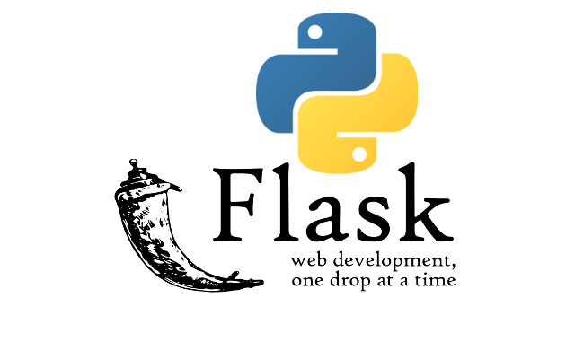

in your terminal (in the same folder as the Dockerfile), run:

docker build -t gharam/faluse:v1.0 .

--> gives your image a name (tag).

Once it’s built, start a container using:

docker run -d -p 5000:5000 --name flask-container gharam/faluse:v1.0

-d → run in detached mode (in the background)

-p 5000:5000 → map port 5000 on your PC to port 5000 inside the container

--name flask-container → name the container

gharam/faluse:v1.0 → the image name you built

http://localhost:5000 — and you’ll see Kolo Tmama ❤🍕
